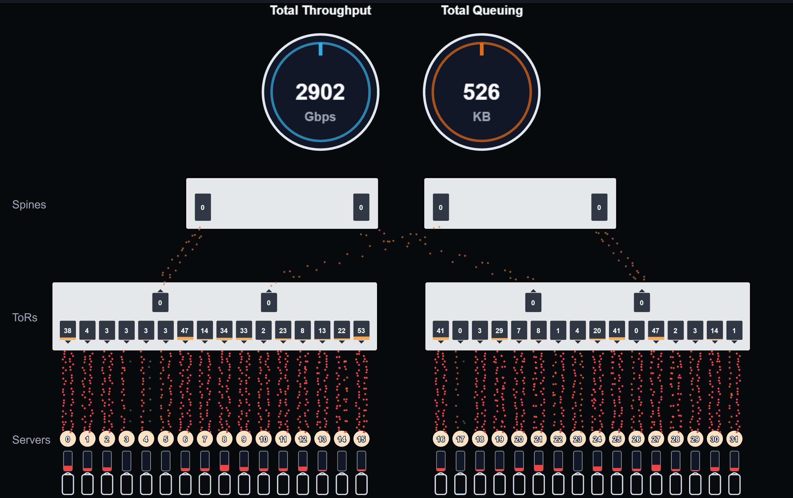

# Network Viz (Vite + TypeScript + PixiJS)

Interactive 2D visualization of computer networks driven by time series data. Includes mock data, nodes, links, queues, and animated packets with simple playback controls.




## Quick start

```bash
npm install
npm run dev
```

Open the URL printed in the terminal (usually http://localhost:5173/).

## Data preparation

- Raw simulation outputs live in `data/` (ignored by git).
- Run `npm run prepare-public-data` to copy the required CSVs into `data_public/`, the dataset the website serves.
- `npm run dev` and `npm run build` invoke this step automatically when `data/` is present. If you only need the checked-in sample data, you can skip it.

## Controls

- Play/Pause: start/stop the animation
- Reset: reset to t = 0
- Speed: change playback speed (0.25x – 3x)

## Where things live

- `src/viz/data.ts`: mock topology, events, and `sample(t)` time series generator
- `src/viz/scene.ts`: PixiJS rendering of nodes, links, queues, and packets
- `src/viz/app.ts`: app bootstrap, ticker, playback controller
- `src/main.ts` + `index.html`: UI wiring and toolbar

## Customization

- Topology: edit `buildLayout()` in `src/viz/data.ts`
- Mock time series: edit `sample(t)` in `src/viz/data.ts`
- Packet events: edit `buildEvents()` in `src/viz/data.ts`

## Using real time series

Plan: load a JSON file containing topology and time series for links/nodes, then drive `scene.update(snapshot)` on each tick.

Proposed JSON shape:

```json
{
  "layout": {
    "nodes": [{ "id": "h1", "type": "host", "x": 0.1, "y": 0.3 }],
    "links": [{ "id": "h1-s1", "a": "h1", "b": "s1" }]
  },
  "duration": 60,
  "series": {
    "links": { "h1-s1": [[0, 0.1], [1, 0.2], [2, 0.05]] },
    "nodes": { "s1": [[0, 0.2], [1, 0.3]] }
  },
  "events": [{ "t": 0.5, "path": ["h1", "s1", "h2"], "color": 16711680 }]
}
```

- Link tuples are `[timeSeconds, throughputNormalized]`
- Node tuples are `[timeSeconds, queueNormalized]`

If you provide sample data in this format, we can wire a loader and interpolation.

## Build

```bash
npm run build
npm run preview
```

## Presenting

- Press browser full-screen (F11) for clean display
- Consider recording with OBS or using CanvasCaptureStream for MP4 if needed later
